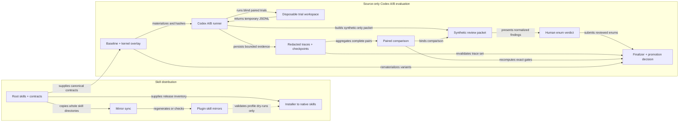

# Assistant Framework Eight-Priority Handoff

This report is a dated, evidence-backed handoff for the eight framework
priorities implemented in the current working tree. It separates source and
contract completion from live promotion evidence so a future maintainer can
reconstruct the decisions, rerun verification, and manually exercise the
result without relying on the original agent transcript.

## Status

- Source implementation and offline verification: complete.
- Current full contract aggregate: 436 passed, 0 failed.
- Current focused evidence: workflow spine 14/14, adaptive execution 12/12,
  calibrated review 6/6, pattern library 11/11, Codex behavioral adapter 90/90,
  eval/finalizer 41/41, context budget 14/14, installer 20/20, and 16/16 skill
  validation.
- Independent correctness, security, execution-context, and documentation
  reviews found two fail-open/hidden-contract issues in the follow-up iteration;
  both were repaired tests-first and the focused suites are green.
- Evaluated v5 Terra snapshot evidence: the authorized host-side replacement completed
  36/36 runs and 18/18 pairs with zero unavailable or incomplete traces. The
  automatic gates reject that snapshot because its baseline and candidate failed
  all nine trials across three must-pass cases. Production remains unchanged.
- Semantic review: the user-authorized human verdict approves all 12 candidate
  findings as supported by the committed synthetic fixture. The canonical
  promotion decision remains false because automatic gates failed.
- Active install: workflow source was refreshed and normalized source/installed
  parity is verified. The installed validator accepts all 36 evaluated v5
  traces, Codex-specific agent configuration is correct, and source-only
  promotion tools remain intentionally absent.

## Architecture Flow



Root `skills/assistant-*` directories remain authoritative. Plugin copies are
generated mirrors, while normal installs still consume the root release
inventory. The promotion runner, finalizer, context reporter, and evidence
helper deliberately remain source-repository-only.

## Changed Behavior and Areas

The framework now treats durable state as freshness-checked evidence, carries
medium-plus requirements through binary acceptance and completion evidence,
uses proportional build/review lanes, records reconstructable final handoffs,
and can consult an optional safe pattern index. The source-only evaluation path
now runs exact blind Codex pairs with durable quota state, bounded diagnostics,
honest model-selection attestation, redacted evidence, semantic review, and
fail-closed promotion gates. Production workflow behavior remains on the full
root because the evaluated lean-kernel snapshot failed its must-pass gates. A
smaller follow-up instruction iteration exists only as statically and
fake-adapter-verified source; it does not inherit the 36-call result.

## Priority Coverage

| Priority | Implemented behavior | Authoritative evidence | Completion state |
|---|---|---|---|
| Journal reconciliation | Treats persisted task state as a freshness-checked claim; current user intent and repository evidence can supersede stale journal state through a typed reconciliation result. | `skills/assistant-workflow/references/task-state-reconciliation.md`, workflow input/output and phase-gate contracts, `tests/p0-p4/workflow-evidence-spine-contracts.sh` | Source and contract verified |
| Real Codex A/B evals | Provides blind paired execution, isolated workspaces, exact case/repeat plans, durable paid-call states, redacted traces, deterministic comparison, bounded synthetic semantic review, and fail-closed finalization. | `tools/evals/run-codex-framework-evals.sh`, `tools/evals/finalize-workflow-kernel-review.sh`, trace/review schemas, `tests/p0-p4/codex-behavioral-eval-contracts.sh` | Adapter and exact 36-run host pilot verified |
| Requirement traceability | Maps each material requirement to a binary acceptance criterion, verification evidence, and manual scenario without creating a second source of truth. | `skills/assistant-workflow/references/requirement-acceptance-map.md`, workflow input/output and completion gates, workflow-spine contracts | Source and contract verified |
| Lean kernel experiment | Keeps the production workflow intact while testing a smaller root overlay under fixed context and behavior promotion gates. | `docs/evals/variants/workflow-kernel-v1/`, `tools/context-budget-report.sh`, context-budget contracts, replacement v5 comparison | Evaluated snapshot complete with automatic no-promotion; follow-up iteration static/fake verified only |
| Ordinary-medium delegation | Defaults ordinary medium, standard-risk work to one bounded edit/test executor plus independent review; separated workers require concrete risk or verification triggers. | workflow execution-lane contracts, `references/build-worker-protocol.md`, agent role prompts, adaptive-execution contracts | Source and contract verified |
| Calibrated review | Uses findings and evidence for exit decisions; rubric scores calibrate focus and residual risk but cannot manufacture work or force extra rounds. | `skills/assistant-review/references/review-loop.md`, `review-rubric.md`, review contracts and eval cases, assistant-review reference contracts | Source and contract verified |
| Rich final handoff | Requires medium-plus handoffs to preserve changed behavior, architecture decisions, rationale, rejected alternatives, requirement evidence, regression surfaces, manual scenarios, limitations, rollback, and bounded review claims. | `skills/assistant-workflow/references/final-handoff.md`, output/completion contracts, workflow-spine contracts | Source and contract verified |
| Optional design-pattern indexing | Supplies an opt-in, metadata-only local adapter with bounded search and safe explicit file reads; missing configuration is a clean `not_configured` result. | `tools/patterns/pattern-library.sh`, `docs/pattern-library.md`, design-pattern retrieval reference, pattern-library contracts | Source and contract verified; personal configuration remains optional |

## Requirement Evidence

No requirement has an approved exclusion.

| Requirement | Acceptance criterion | Verification result and evidence | Status |
|---|---|---|---|
| R1 — Journal reconciliation | Newest user and repository evidence supersede stale state; repaired current identity, reason, prior disposition, and exact next action are persisted before continuation. | Workflow evidence spine 14/14, stale-journal workspace predicates, and reconciled `.codex/task.md`. | Passed |
| R2 — Real Codex A/B | Execute 36 exact Terra runs as 18 blind pairs with durable one-start attempt state, strict provenance, complete traces, and no raw retention. | Evaluated replacement v5 snapshot: 36/36 traces, 18/18 pairs, zero incomplete/unavailable, strict source and installed validation. | Passed |
| R3 — Requirement traceability | Medium-plus requirements retain stable ids, binary criteria, verification/evidence, manual scenarios, exclusions, and final status; this task closes only when every R1–R8 entry is passed or excluded. | Requirement contracts and concrete artifact verifier; workflow evidence spine 14/14; this closed R1–R8 implementation matrix. | Passed — eight-priority implementation scope |
| R4 — Lean kernel experiment | Meet static limits, collect exact live evidence, and promote only when automatic and semantic gates pass; otherwise record a bound no-promotion decision. | The evaluated hash-bound snapshot passed static limits and completed its pilot; the authorized semantic verdict approves 12/12 findings; canonical decision records `behavioral_promotion_eligible=false`. | Passed — evaluated experiment closed with no promotion; follow-up iteration unpromoted |
| R5 — Ordinary-medium delegation | Default standard medium work to one bounded RED/GREEN/focused-verification owner plus independent review. | Adaptive execution contracts 12/12 and evaluated-snapshot pilot ordinary-medium case 6/6 across variants. | Passed |
| R6 — Calibrated review | Use evidence-driven review rounds and bounded claims; round 3+ needs new evidence and round 10 is terminal. | Review calibration 6/6; seeded live review detects 12/12 defects per variant with zero known false-positive markers. | Passed |
| R7 — Rich final handoff | Include all ten required handoff sections with exact verification and developer-runnable manual scenarios. | This dated report, workflow evidence spine 14/14, and the sections below. | Passed |
| R8 — Optional pattern index | Missing config is a safe no-op; configured indexing is metadata-first and rejects unsafe paths/symlinks. | Pattern contracts 11/11 and installed-tool parity. | Passed |

## Architecture Decisions, Rejected Alternatives, and Trade-offs

| Decision | Rationale | Trade-off or boundary |
|---|---|---|
| Keep one compatibility workflow entrypoint and use progressive disclosure. | Smart frontier models benefit more from a lean always-loaded root than from phase-by-phase skill fragmentation. | Detailed contracts still exist and are loaded only at the enforcing boundary. |
| Reconcile journals instead of trusting or deleting them. | Durable state must survive compaction, but stale state must not override newer intent or repository facts. | Reconciliation adds a small typed artifact only when evidence conflicts. |
| Use a requirement evidence spine. | Vague personal tasks and weak company tickets need explicit coverage through completion. | Small tasks keep compact acceptance and verification instead of a full matrix. |
| Default ordinary medium work to `bounded_executor`. | One owner preserves TDD and local coherence while an independent reviewer protects against regressions. | High-risk or noisy verification still escalates to separated workers. |
| Make review findings-based, not score-driven. | Numeric targets can cause context-filled agents to invent work or churn late in a loop. | Scores remain useful for risk communication and focus. |
| Evaluate the lean kernel as an overlay, not an immediate replacement. | Static savings alone do not prove behavioral safety. | Production remains unchanged until exact live and human gates approve promotion. |
| Do not promote the evaluated kernel snapshot. | Both evaluated variants passed 9/18 runs, but both failed all trials for journal repair, requirement-map exactness, and rich final handoff; `candidate_must_pass_failed_runs=9`. | That candidate did not regress pairwise and retained full seeded-review recall, but shared must-pass failures are sufficient to reject promotion. The edited follow-up candidate has no live result yet. |
| Persist only bounded eval evidence. | Raw prompts, JSONL, responses, workspaces, and stderr can contain sensitive or excessive content. | Human semantic review is limited to normalized synthetic seeded findings. |
| Attest requested model selection honestly. | The [official Codex non-interactive JSONL documentation](https://learn.chatgpt.com/docs/non-interactive-mode#make-output-machine-readable) exposes `thread_id` but not backend runtime model identity. | The completed v5 chain proves that the trusted local CLI advertised and was explicitly invoked with the exact Terra slug; no provider-signed backend runtime resolution is claimed. |
| Keep pattern libraries opt-in and metadata-first. | Personal examples should help local development without leaking paths or becoming company dependencies. | No configuration is created automatically, and results stay deliberately small. |

## Lean-Kernel Measurements

The immutable evaluated v5 snapshot was bound to manifest
`99fc40c5d680b7b8c1c339ecca016716e1679fd066abfede3f09c32a1d196732`,
baseline instruction `21b2190f089dea29b812b883aa80d6937ae62278680dfbb61d56687cc6887c12`,
candidate instruction `571a5546fc62dae803e0a6c8c1cfdeb2547c4694172df5d98222c282c82962d4`,
and context evidence
`4da7918b95361eb520432f551acc2e98101858362710dc8e70dce5b49c85ffb8`:

| Boundary | Production workflow | Kernel candidate | Delta |
|---|---:|---:|---:|
| Selected skill initial words | 1,566 | 884 | -682 |
| Selected skill entry-boundary words | 3,243 | 2,561 | -682 |
| Total initial words | 2,501 | 1,819 | -682 |
| Total entry-boundary words | 4,178 | 3,496 | -682 |

The current, unevaluated follow-up iteration measures:

| Boundary | Production workflow | Kernel candidate | Delta |
|---|---:|---:|---:|
| Selected skill initial words | 1,591 | 909 | -682 |
| Selected skill entry-boundary words | 3,268 | 2,586 | -682 |
| Total initial words | 2,532 | 1,850 | -682 |
| Total entry-boundary words | 4,209 | 3,527 | -682 |

The current candidate remains under the fixed 1,000/2,600 selected-skill caps
with zero standing-context growth. This proves static budget compliance only;
the current manifest (`f2d52cbe9f82e9a373166f9227ee7450ee4b2e86ac1b673a84177cd1aea6fac9`)
and candidate instruction
(`b29c8647a1ec79b878fc115211075e084aedbda88324229d7a630118b62e2ac0`)
differ from the evaluated snapshot; the current production instruction is
`870e92c78aab4639ee6d70fc768c5e03fc073ae566e455999101fc3dda28e260`.
This follow-up iteration has no live behavioral evidence.

## Verification Commands

Run the registered aggregate and focused high-risk suites from the repository
root:

```bash
./tests/test-p0-p4-contracts.sh
bash tests/p0-p4/codex-behavioral-eval-contracts.sh
bash tests/p0-p4/eval-contracts.sh
bash tests/p0-p4/context-budget-report-contracts.sh
bash tests/p0-p4/installer-contracts.sh
tools/skills/validate-skills.sh
tools/plugins/sync-plugin-skills.sh --check
tools/skills/sync-skill-contract-guide.sh --check
git diff --check
```

Reproduce the kernel measurement:

```bash
tools/context-budget-report.sh --agent codex --skill assistant-workflow --format json
tools/context-budget-report.sh --agent codex --skill assistant-workflow \
  --skill-overlay docs/evals/variants/workflow-kernel-v1/SKILL.md \
  --format json
```

## Manual Test Guide

### 1. Vague personal-development task

- **Setup:** Use a disposable project and prepare a medium request with one
  implementation-shaping ambiguity plus one omitted safe default.
- **Actions:** 1. Submit the request. 2. Answer only a genuinely material
  question, if asked. 3. Inspect the plan and requirement map before Build.
- **Expected:** The assistant separates material uncertainty from harmless
  detail, recommends a path, records the safe default, asks no ritual question,
  and creates requirement ids with binary criteria and verification methods.

### 2. Weak company task

- **Setup:** In a disposable repository, provide a short feature ticket that
  omits edge cases, compatibility, and verification.
- **Actions:** 1. Submit the ticket. 2. Inspect discovered gaps and proposed
  defaults. 3. Trace every added criterion to the ticket or a labeled assumption.
- **Expected:** Missing requirements are surfaced, defaults stay bounded,
  exclusions are explicit, and the ticket remains the source of truth.

### 3. Stale journal after compaction

- **Setup:** Prepare a journal naming an already-merged branch while the newest
  request and repository evidence identify different work.
- **Actions:** 1. Ask the assistant to continue. 2. Inspect the journal before
  any source edit. 3. Compare repaired state with Git and the newest request.
- **Expected:** The prior task is separately superseded, the current task is
  active, the reason cites evidence, and an exact next action is persisted.

### 4. Ordinary medium implementation

- **Setup:** Provide a standard-risk medium behavior change with focused tests
  and authorize subagents.
- **Actions:** 1. Approve the medium plan. 2. Observe Build ownership. 3. Inspect
  RED, GREEN, focused verification, and independent review evidence.
- **Expected:** The lane is `bounded_executor`; one owner keeps the edit/test
  loop coherent, an independent reviewer follows, and no fictitious separated
  Builder/Tester dispatch is reported.

### 5. Regression-oriented code review

- **Setup:** Use a synthetic change containing a requirement omission, input
  mutation, missing invalid-input rejection, and a test with no behavioral assertion.
- **Actions:** 1. Request review. 2. Match findings to source lines and all four
  defects. 3. Apply fixes and request one fresh re-review.
- **Expected:** All material defects are reported, unrelated style comments do
  not block, and a clean re-review does not trigger score-driven extra rounds.

### 6. Rich completion handoff

- **Setup:** Complete a disposable medium change with one architecture decision,
  one rejected alternative, automated evidence, and a known limitation.
- **Actions:** 1. Request completion. 2. Give only the report to another
  developer. 3. Have that developer locate verification and execute its manual
  scenario without the original conversation.
- **Expected:** The report reconstructs behavior, decisions/rationale, rejected
  alternatives, requirement evidence, exact commands, expected observations,
  regression surfaces, limitations, rollback, and review scope.

### 7. Optional pattern retrieval

- **Setup:** Start without configuration; later use a disposable reviewed
  library containing one safe example and one symlink escape.
- **Actions:** 1. Run:

```bash
tools/patterns/pattern-library.sh search --query factory
```

  2. Configure the disposable library using `docs/pattern-library.md`. 3. Build
  and search the index. 4. Show one safe relative path, then try the unsafe path.
- **Expected:** The first call returns non-interactive `not_configured`; search
  returns bounded metadata without roots or source bodies; the safe file can be
  shown and the symlink/traversal path is rejected.

### 8. Terra pilot

- **Setup:** Use the source repository, current authenticated Codex CLI, exact
  Terra model, six manifest cases, three repeats, and two variants. After any
  instruction, fixture, runner, or manifest hash drift, choose a new empty
  output and generate a fresh plan; never reuse an older plan or output.
- **Actions:** 1. Generate the fresh plan without `--execute`. 2. Confirm 18
  pairs, 36 runs, balanced ordering, current hashes, and all caps. 3. With
  explicit authorization, run host-side. 4. Validate traces with
  `tools/evals/run-framework-instruction-evals.sh --validate-traces OUTPUT/traces`.
  5. Reproduce comparison with
  `tools/evals/run-framework-instruction-evals.sh --compare-traces OUTPUT/traces`
  and compare it with `OUTPUT/comparison.json`. 6. Inspect retention and the
  semantic packet.
- **Expected:** Every attempt has one start and one completed trace; all pairs
  are exact; no raw artifacts remain; failed must-pass gates keep
  `behavioral_promotion_eligible=false` and production unchanged.

## Terra Pilot Evidence

The authorized evaluated-snapshot execution used the exact six manifest cases,
three repeats, and two variants (36 calls). Its reviewed plan records:

- requested slug `gpt-5.6-terra`;
- 18 pairs and 36 runs with balanced first-run ordering;
- 600-second per-run and 5,400-second total limits;
- 30-second, 4 MiB-bounded catalog checks;
- at most one tolerated incomplete pair;
- default-binary provenance and promotion ineligibility in plan-only mode.

The following no-call plan is historical evidence for the evaluated snapshot,
not a current executable plan:

`/private/tmp/codex-framework-v5-terra-pilot-plan-20260712-c/run-plan.json`
(SHA-256 `e1c4535b34e3e8543327cb5a021ee4d97215839e02c4374d307fe2613fde3481`).
It contains 18 pairs and 36 runs, with 9 baseline-first and 9 candidate-first
pairs. Because current instruction, fixture, runner, and manifest hashes differ,
it must never be resumed or reused. Host-side no-model checks at that time
passed: nested Seatbelt capability was
available, Codex reported a valid ChatGPT login, `codex doctor --json` reported
no failed checks, and the catalog contained exactly one visible, API-supported
`gpt-5.6-terra` entry.

During execution, stop after a second incomplete pair. Never retry an uncertain
`in_flight` run. After complete evidence, review the bounded synthetic packet
and finalize with an explicit human enum verdict; `comparison.json` alone cannot
promote the candidate.

The first v5 attempt at
`/private/tmp/codex-framework-v5-terra-pilot-20260712-a` is immutable diagnostic
evidence only. It recorded four `completed` attempt states and 32 `not_started`
states; all four traces were `adapter_unavailable` with exit code 1 and the
historical bounded code `codex_exit_nonzero`. Two incomplete pairs triggered
the breaker before call five. There was no uncertain `in_flight` record and no
comparison, semantic packet, verdict, or promotion decision. Raw prompts,
responses, JSONL, and stderr were not retained, so the exact cause cannot be
reconstructed or relabeled. Host-side login and capability checks point to the
outer macOS Seatbelt context as the strongest diagnosis, but it remains an
inference. The current runner bytes and grader binding have changed since that
attempt, so the output cannot be resumed or used for current promotion.

The authorized replacement evaluated the hash-bound v5 snapshot at
`/private/tmp/codex-framework-v5-terra-pilot-replacement-20260712-b`
completed successfully:

- 36/36 attempt states and traces are `completed`, each with exactly one start;
- 18/18 exact pairs are complete, with zero excluded or incomplete pairs;
- all traces request `gpt-5.6-terra`, use the explicit honest runtime
  attestation, and record `raw_artifacts_retained=false`;
- baseline and candidate each passed 9/18 runs;
- both variants passed every ordinary-medium, seeded-review, and small-fix
  trial, and both failed every stale-journal, requirement-map, and final-handoff
  trial;
- both variants detected 12/12 seeded defects with zero false-positive marker
  hits and zero scope deviations;
- comparison gates report zero pairwise regressions and acceptable tool/rework
  medians, but `candidate_must_pass_failed_runs=9` and
  `candidate_must_pass_failed_cases=3`, so automatic behavioral gates and
  promotion eligibility are false;
- the semantic packet is ready with three pairs and 12 candidate findings, all
  supported by the synthetic fixture on manual inspection;
- no raw JSONL, stderr, prompt, final-response, Markdown, credential, or private
  source artifact was retained.

This is a successful evaluation run and a negative promotion result. It proves
the adapter and promotion gates work fail-closed; it does not justify weakening
the gates or replacing the production workflow root.

After finalization, a compact follow-up iteration added native continuation
routing, exact external-schema precedence, complete closed-world fixture
disclosure, and stricter semantic handoff grading. It passes current static and
fake-adapter verification but is not represented by the 36 traces. Any
confirmation smoke needs a newly generated plan and separate call
authorization; any promotion decision requires a fresh exact promotion profile.

## Compatibility and Regression Surfaces

- Root `skills/assistant-*` remain authoritative; generated assistant-dev plugin
  mirrors are synchronized and normal installs still consume root inventory.
- Codex, Claude, and Gemini share provider-neutral contracts; only Codex has the
  live v5 behavioral evidence, and no provider-specific workflow fork was added.
- Existing small-task routing stays compact; durable maps and rich handoffs are
  medium-plus or promoted-risk behavior.
- Ordinary-medium work changes dispatch policy, so build/recovery gates, role
  prompts, TDD ownership, and independent review were checked together.
- Trace schema, validator, comparison logic, finalizer, fixtures, and installed
  eval docs are a single compatibility surface; v2/v3/v4 evidence remains
  diagnostic-only and cannot be mixed into v5 promotion.
- Installer-owned skills, agents, rules, global guidance, memory protocol, and
  legacy eval tools were refreshed; source-only promotion tools remain excluded.
- Optional pattern retrieval adds no default configuration, company dependency,
  absolute personal path, or source-body indexing.

## Known Limitations and Untested Areas

- Codex JSONL does not provide provider-signed backend model identity; the
  evidence proves exact local catalog selection and invocation only.
- Raw prompts, responses, workspaces, events, and stderr are intentionally
  deleted, so failed-run diagnosis is bounded to verifier ids and safe summaries.
- The evaluated pilot exposed shared weakness in three must-pass cases: neither
  evaluated root produced accepted journal repair, exact requirement-map
  artifacts, or exact rich-handoff artifacts. That kernel snapshot is not
  promoted. The follow-up iteration addresses the bounded root causes but has
  no live evidence yet.
- Claude and Gemini did not receive separate live pilots; provider-neutral
  static/contract compatibility is verified, matching their nice-to-have scope.
- Manual scenarios are developer-runnable documentation and were not executed
  as a completion gate because `manual_verification_mode=optional`.
- The canonical user-authorized semantic verdict and fail-closed promotion
  decision are complete; the decision is bound to the evaluated instruction and
  evidence hashes and remains historical evidence if a new iteration changes them.

## Review Claim

No material findings within the reviewed scope and available evidence.

Scope: current source/contracts/tests, plugin mirrors, completed evaluated-v5
traces and comparison, bounded synthetic packet, documentation, and automatic
no-promotion decision. Current install parity is verified separately after the
final refresh. This claim does not transfer the evaluated result to the edited
follow-up candidate or attest provider-side runtime model identity.

## Rollback and Remaining Gates

- Production behavior has not been switched to the kernel overlay. Rollback of
  the experiment is therefore removal or non-use of
  `docs/evals/variants/workflow-kernel-v1`; no production skill rollback is
  required.
- No further live calls are required to decide the evaluated snapshot: its
  automatic must-pass failures reject promotion. The current follow-up
  iteration requires a fresh plan and separately authorized evidence; the old
  plan and output cannot be reused.
- The bounded semantic review and canonical finalizer artifacts are complete;
  semantic approval did not and cannot override the failed automatic gates.
- The installed workflow is refreshed and parity-checked, the installed
  validator accepts all 36 evaluated v5 traces, and source-only promotion tools
  remain absent.
- Historical v2/v3 records that used the earlier `resolved_model` vocabulary and
  the breaker-stopped v5 output must remain labeled diagnostic-only. They do not
  prove backend model identity and cannot satisfy the evaluated v5 promotion
  gates or any future hash-different profile.

## Safety Notes

- No credentials, private endpoints, customer data, personal pattern-library
  paths, raw model prompts, raw model responses, or raw model catalogs are
  included in this report.
- The accepted local trust boundary is the source repository and default Codex
  executable found on `PATH`; hashes detect drift but are not provider signatures.
- Untrappable host failure can still leave mode-0700 temporary trial data. Such
  data is not promotion evidence and should be removed under the applicable
  local retention policy after confirming no eval process is live.
