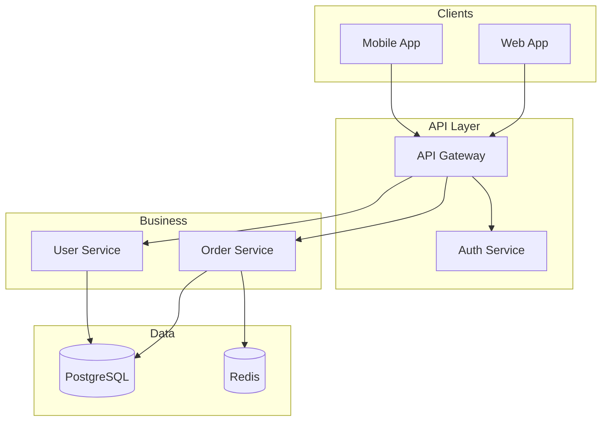

# Architecture Diagram

## Protocol

### Step 1: Identify Components

Scan the codebase for architectural boundaries:
- **Projects/assemblies** (.csproj, package.json)
- **Namespaces/modules** that represent logical groupings
- **External systems** (databases, APIs, queues, file systems)
- **Clients** (web app, mobile app, CLI, other services)

### Step 2: Map Relationships

For each component, determine:
- What it depends on (project references, using statements, imports)
- What depends on it
- How it communicates (HTTP, gRPC, events, direct call)

### Step 3: Generate

### Guidelines

- Use `subgraph` for architectural layers
- Databases get cylinder shape `[( )]`
- External services get double brackets `[[ ]]`
- Direction: TD (top-down) for layered, LR for pipeline
- Max 15-20 nodes — split into L0/L1 if larger
