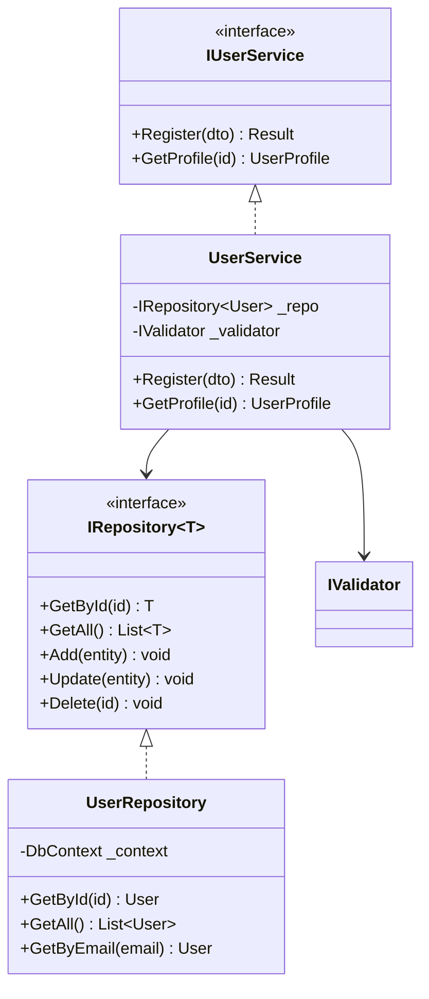

# Class Diagram

## Protocol

### Step 1: Identify Scope

Don't diagram every class. Focus on:
- A specific feature's type hierarchy
- Interface and implementation relationships
- Design pattern structure
- The types the user is asking about

### Step 2: Extract Type Information

For each relevant type:
- Class/interface/abstract/enum
- Key properties and methods (not all — just the important ones)
- Inheritance relationships
- Interface implementations
- Composition and aggregation

### Step 3: Generate

### Guidelines

- Use `<<interface>>` and `<<abstract>>` stereotypes
- Show only 3-5 key members per type
- Solid arrow with triangle for inheritance
- Dashed arrow for implementation
- Solid arrow for composition/dependency
- Max 10-12 types per diagram
