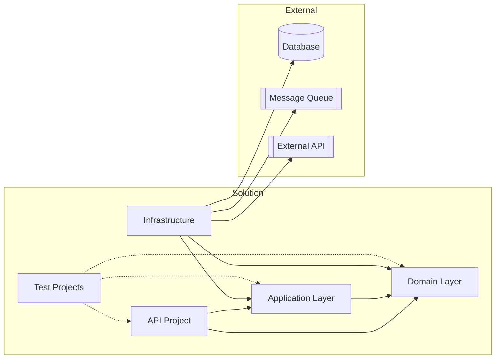

# Component Diagram

## Protocol

### Step 1: Identify Components

Components are deployable or logically independent units:
- .NET projects in a solution
- npm packages in a monorepo
- Microservices
- Shared libraries
- External systems

### Step 2: Map Dependencies

For each component:
- What it depends on (project references, package references)
- What depends on it
- Interface boundaries (what's exposed vs. internal)

### Step 3: Generate

### Guidelines

- Solid arrows for runtime dependencies
- Dashed arrows for test/dev dependencies
- Group by deployment boundary with `subgraph`
- Show dependency direction (arrow points TO the dependency)
- Highlight violations (e.g., Domain depending on Infrastructure) with red styling
