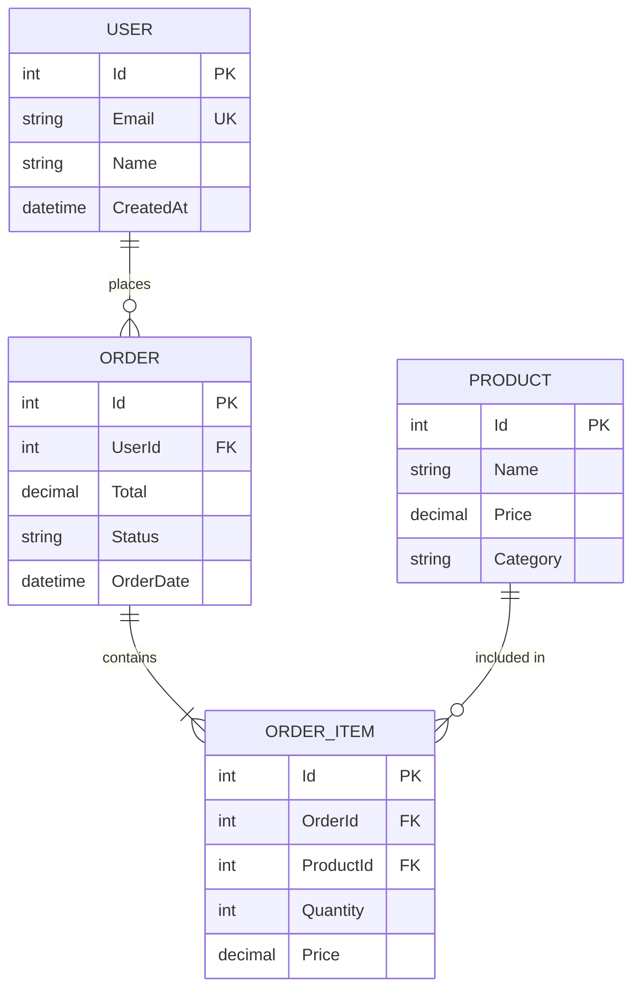

# Entity-Relationship Diagram

## Protocol

### Step 1: Find Entities

Scan for data models:
- **EF Core**: DbContext, entity classes, configurations
- **Dapper**: SQL queries, mapped types
- **Other ORMs**: model definitions
- **Database migrations**: schema definitions

### Step 2: Map Relationships

For each entity:
- Primary key
- Foreign keys and navigation properties
- Relationship type (one-to-one, one-to-many, many-to-many)
- Key attributes (not every column — focus on what matters)

### Step 3: Generate

### Guidelines

- Show PK, FK, and unique keys
- Include only the most important attributes (5-8 per entity)
- Label relationships with verb phrases
- Use correct cardinality notation:
  - `||--||` one-to-one
  - `||--o{` one-to-many
  - `}o--o{` many-to-many
- For large schemas, group related entities and create multiple diagrams
