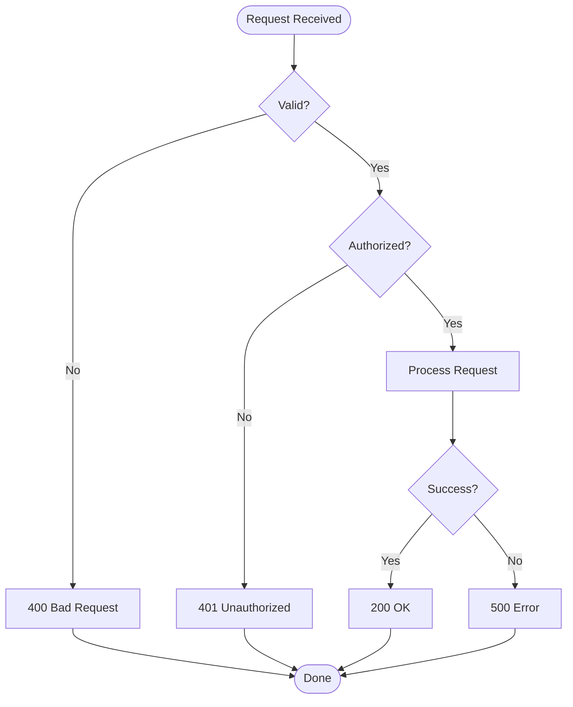

# Flow Diagram

## Protocol

### Step 1: Identify the Process

Determine what flow to diagram:
- Business logic / decision tree
- Algorithm steps
- Deployment pipeline
- Error handling flow
- State transitions (use state-diagram.md for formal state machines)

### Step 2: Trace Logic

Read the actual code and map:
- Start and end points
- Decision points (if/else, switch, pattern matching)
- Actions at each step
- Loops and iterations
- Error/exception paths

### Step 3: Generate

### Guidelines

- Rounded boxes `([text])` for start/end
- Diamonds `{text}` for decisions
- Rectangles `[text]` for actions
- Label decision edges with condition
- Show error/exception paths — don't just diagram the happy path
- Direction: TD for processes, LR for pipelines
- Max 15-20 nodes per diagram
