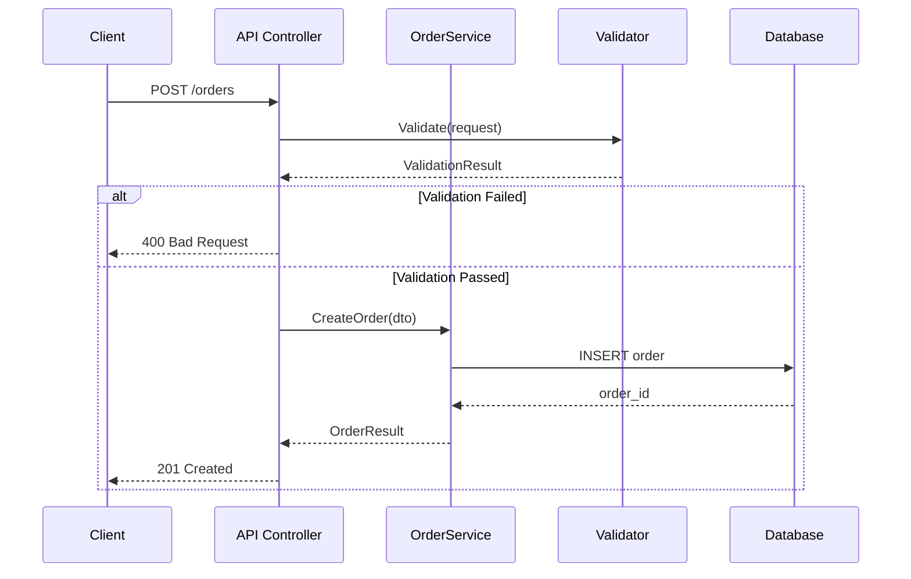

# Sequence Diagram

## Protocol

### Step 1: Choose the Flow

Pick the most important or requested interaction:
- Primary user action (e.g., "user places an order")
- A specific request path the user asks about
- The most complex interaction in the system

### Step 2: Trace the Code Path

Actually trace the code from entry point to response:
- Start at the controller/endpoint/handler
- Follow each method call
- Note async boundaries, database calls, external API calls
- Track the return path

### Step 3: Generate

### Guidelines

- Solid arrows (`->>`) for synchronous calls
- Dashed arrows (`-->>`) for returns
- Use `alt/else` for branching
- Use `loop` for iterations
- Use `par` for parallel operations
- Use `Note` for important context
- Max 8-10 participants — split complex flows
- Name participants with short aliases
