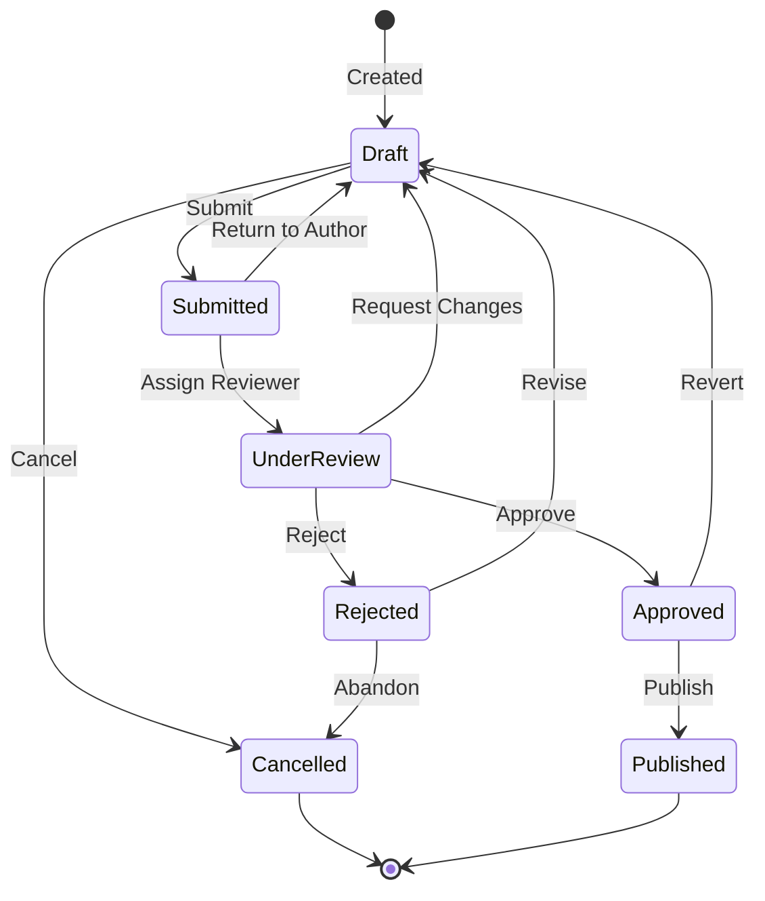

# State Diagram

## Protocol

### Step 1: Identify State Machine

Look for:
- Enum-based status fields (OrderStatus, TaskState, etc.)
- State pattern implementations
- Workflow engines or process definitions
- FSM libraries

### Step 2: Map States and Transitions

For each state:
- What triggers the transition (event/action)
- Guard conditions (when is the transition allowed)
- Entry/exit actions (what happens on transition)

### Step 3: Generate

### Guidelines

- `[*]` for start and end states
- Label transitions with the triggering event
- Add notes for guard conditions when complex
- Use `state "Display Name" as alias` for long state names
- Show all valid transitions, including error/rollback paths
- Max 10-12 states per diagram
